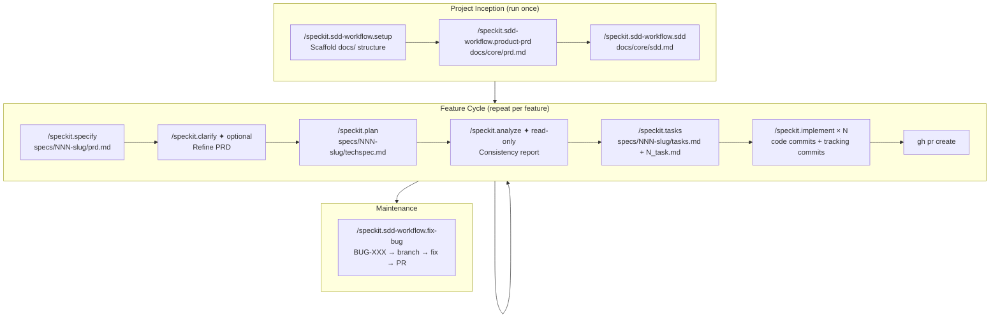

# spec-kit-extension-sdd-workflow

A [Spec Kit](https://github.com/github/spec-kit) extension that adds the **project inception and health management layer** missing from Spec Kit core.

Designed to work alongside [`spec-kit-preset-sdd-workflow`](https://github.com/fabfdev/spec-kit-preset-sdd-workflow), which replaces Spec Kit's feature commands.

---

## Without this extension vs. with it

| Aspect | Spec-kit + preset only | + SDD Workflow Extension |
|--------|------------------------|--------------------------|
| Project initialization | Manual | `/speckit.sdd-workflow.setup` scaffolds everything |
| Product context | None | `docs/core/prd.md` — vision, personas, KPIs, business rules |
| Architecture context | None | `docs/core/sdd.md` — stack, patterns, naming conventions |
| Feature command intelligence | Generic | All preset commands read `sdd.md` to avoid redundant questions and enforce consistent output |
| Bug tracking | None | `BUG-XXX` docs with `bugfix/` branch, fix, tests, and PR |
| Health dashboard | None | `docs/health/status.md`, `scan.md`, `fix.md` |

### Why `docs/core/sdd.md` matters

`sdd.md` is the most critical file in the entire workflow. When it exists:

- `/speckit.clarify` skips questions already answered in the architecture doc
- `/speckit.plan` uses the correct stack and test framework — no guessing
- `/speckit.analyze` treats `sdd.md` as the authority: any conflict with it is **CRITICAL**
- `/speckit.implement` follows naming conventions, folder structure, and import patterns from the doc

Without `sdd.md`, the preset commands still work — they just have less context and ask more questions.

---

## Full lifecycle diagram



---

## Commands

| Command | Artifact | Description |
|---------|----------|-------------|
| `/speckit.sdd-workflow.setup` | `docs/` structure | Initializes roadmap, health dashboards, and folder layout. **Run once after installing.** |
| `/speckit.sdd-workflow.product-prd` | `docs/core/prd.md` | Creates the product-level PRD: vision, target users, personas, KPIs, user flows, and business rules |
| `/speckit.sdd-workflow.sdd` | `docs/core/sdd.md` | Creates the Software Design Document: stack, folder structure, data model, naming conventions, test strategy. Collaborative session — agent researches libraries, questions decisions, suggests alternatives |
| `/speckit.sdd-workflow.fix-bug` | `docs/health/bugs/BUG-XXX.md` | Registers a bug, creates `bugfix/BUG-XXX` branch, implements the fix, runs tests, opens PR |

---

## How to install

### Prerequisites

- [Spec Kit CLI](https://github.com/github/spec-kit) installed
- A project initialized with `specify init`

### Install the extension only

```bash
specify extension add sdd-workflow \
  --from https://github.com/fabfdev/spec-kit-extension-sdd-workflow/archive/refs/tags/v1.0.0.zip
```

### Recommended: install with the companion preset

The preset replaces Spec Kit's core feature commands. Together, the preset + extension cover the full SDD lifecycle.

```bash
# 1. replace core commands with SDD workflow
specify preset add sdd-workflow \
  --from https://github.com/fabfdev/spec-kit-preset-sdd-workflow/archive/refs/tags/v1.1.0.zip

# 2. add inception and health commands
specify extension add sdd-workflow \
  --from https://github.com/fabfdev/spec-kit-extension-sdd-workflow/archive/refs/tags/v1.0.0.zip
```

---

## How to use

### Step 1 — Initialize (once per project)

```
/speckit.sdd-workflow.setup
```

Creates:
- `docs/core/roadmap.md`
- `docs/health/status.md`, `scan.md`, `fix.md`
- `docs/health/bugs/` and `docs/health/debt/` folders

### Step 2 — Define the product (once per project)

```
/speckit.sdd-workflow.product-prd
```

The agent asks about: product vision, target users, personas, main user flows, KPIs, and business rules. It drafts `docs/core/prd.md`, presents for approval, then saves and commits.

### Step 3 — Define the architecture (once per project)

```
/speckit.sdd-workflow.sdd
```

The agent conducts a collaborative design session: it researches your chosen libraries, questions decisions, and suggests alternatives where needed. It drafts `docs/core/sdd.md` with: stack, folder structure, data model, naming conventions, test framework, and observability setup. Presents for approval before saving.

### Step 4 — Feature cycle

With inception done, run the feature cycle from the preset:

```
/speckit.specify   [feature description]
/speckit.clarify
/speckit.plan      [stack hints if not in sdd.md]
/speckit.analyze
/speckit.tasks
/speckit.implement [task number]
```

### Step 5 — Bug tracking (as needed)

```
/speckit.sdd-workflow.fix-bug [describe the bug]
```

---

## Usage example

```
# — Initialize a new project —
/speckit.sdd-workflow.setup

  Creates: docs/core/roadmap.md, docs/health/, docs/health/bugs/, docs/health/debt/

# — Define the product —
/speckit.sdd-workflow.product-prd

  Agent: asks about vision, users, personas, flows, KPIs, business rules
  Drafts docs/core/prd.md, waits for approval
  After approval: saves and commits

# — Define the architecture —
/speckit.sdd-workflow.sdd

  Agent: asks about stack, tests, folder structure, naming, observability
  Researches chosen libraries via current documentation
  Drafts docs/core/sdd.md, presents for approval
  After approval: saves and commits

  Example sdd.md sections:
    ## Stack: React + Vite, TypeScript, Prisma, Node.js
    ## Test framework: Vitest (unit), Playwright (E2E)
    ## Naming: PascalCase components, camelCase functions, kebab-case files
    ## Folder: src/features/[name]/{components,hooks,services}

# — From here, run the feature cycle —
/speckit.specify I want to add a dashboard with usage metrics

  Agent: reads docs/core/prd.md and sdd.md/Contexto do Projeto
  Skips questions already answered there
  → specs/002-usage-dashboard/prd.md

# — Bug appears in production —
/speckit.sdd-workflow.fix-bug Dashboard crashes when date range spans multiple years

  Agent:
    1. Creates docs/health/bugs/BUG-001-dashboard-date-crash.md
       (impact, location, reproduction steps, root cause)
    2. Asks: fix now or defer?
    3. Fix now → creates branch: bugfix/BUG-001-dashboard-date-crash
    4. Reads sdd.md to use correct conventions
    5. Implements fix, runs tests
    6. Presents for validation
    7. After approval:
         commit: "fix: handle multi-year date range in dashboard (BUG-001)"
         updates BUG-001 doc to: resolved
         opens PR
```

---

## How to remove

Removing the extension deletes the installed commands. **Files already generated (`docs/core/`, `docs/health/`) are not deleted.**

```bash
specify extension remove sdd-workflow
```

To also remove the companion preset:

```bash
specify preset remove sdd-workflow
```

---

## File structure generated

```
docs/
  core/
    roadmap.md          ← macro feature tracking (auto-updated by preset)
    prd.md              ← product PRD
    sdd.md              ← architecture document (most critical file)
  health/
    status.md           ← living dashboard of open bugs and debt
    scan.md             ← guide: when and how to run health scans
    fix.md              ← process guide for bugs and technical debt
    bugs/
      BUG-001-title.md
      BUG-002-title.md
    debt/
      TD-001-title.md

specs/                  ← created by the preset during feature cycles
  001-[feature]/
    prd.md
    techspec.md
    tasks.md
    1_task.md
    ...
```

---

## Updating to a new version

```bash
specify extension remove sdd-workflow
specify extension add sdd-workflow \
  --from https://github.com/fabfdev/spec-kit-extension-sdd-workflow/archive/refs/tags/vX.Y.Z.zip
```

---

## Publishing a new version (maintainer)

```bash
# 1. edit commands/, bump version in extension.yml
git add . && git commit -m "chore: bump extension to vX.Y.Z"
git push

# 2. create release (no SSH needed)
gh release create vX.Y.Z \
  --repo fabfdev/spec-kit-extension-sdd-workflow \
  --title "vX.Y.Z" \
  --notes "What changed."
```

---

## Companion preset

This extension pairs with [`spec-kit-preset-sdd-workflow`](https://github.com/fabfdev/spec-kit-preset-sdd-workflow), which replaces Spec Kit's core commands (`speckit.specify`, `speckit.clarify`, `speckit.plan`, `speckit.analyze`, `speckit.tasks`, `speckit.implement`) with an opinionated SDD implementation featuring:

- Sequential feature numbering (`specs/NNN-[slug]/`)
- Mandatory human approval gates
- Conventional commits
- Two-commit discipline per task
- Full roadmap lifecycle tracking

---

## License

MIT
