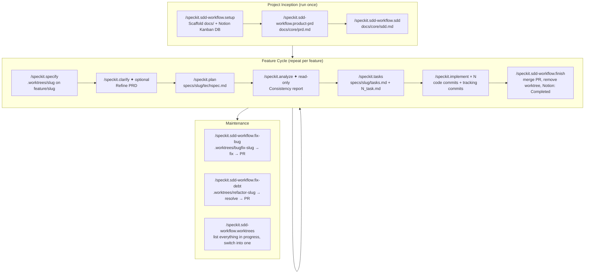

# spec-kit-extension-sdd-workflow

A [Spec Kit](https://github.com/github/spec-kit) extension that adds the **project inception, health management, and parallel-work layer** missing from Spec Kit core.

Designed to work alongside [`spec-kit-preset-sdd-workflow`](https://github.com/fabfdev/spec-kit-preset-sdd-workflow), which replaces Spec Kit's feature commands.

---

## Without this extension vs. with it

| Aspect | Spec-kit + preset only | + SDD Workflow Extension |
|--------|------------------------|--------------------------|
| Project initialization | Manual | `/speckit.sdd-workflow.setup` scaffolds everything, including the Notion Kanban database |
| Product context | None | `docs/core/prd.md` — vision, personas, KPIs, business rules |
| Architecture context | None | `docs/core/sdd.md` — stack, patterns, naming conventions |
| Feature command intelligence | Generic | All preset commands read `sdd.md` to avoid redundant questions and enforce consistent output |
| Bug tracking | None | Notion page (`Type = Bug`) + dedicated worktree on `bugfix/[slug]`, fix, tests, PR |
| Tech debt tracking | None | Notion page (`Type = Tech Debt`) + dedicated worktree on `refactor/[slug]`, resolution, tests, PR |
| Parallel work | Not supported | Every feature/bug/debt gets its own git worktree; `worktrees` and `finish` manage the lifecycle |

### Why `docs/core/sdd.md` matters

`sdd.md` is the most critical file in the entire workflow. When it exists:

- `/speckit.clarify` skips questions already answered in the architecture doc
- `/speckit.plan` uses the correct stack and test framework — no guessing
- `/speckit.analyze` treats `sdd.md` as the authority: any conflict with it is **CRITICAL**
- `/speckit.implement` follows naming conventions, folder structure, and import patterns from the doc

Without `sdd.md`, the preset commands still work — they just have less context and ask more questions.

---

## Full lifecycle diagram



---

## Commands

| Command | Artifact | Description |
|---------|----------|-------------|
| `/speckit.sdd-workflow.setup` | Notion Kanban DB, `docs/health/scan.md` | Provisions the Notion Kanban database and scaffolds the local `docs/` layout. **Run once after installing.** |
| `/speckit.sdd-workflow.product-prd` | `docs/core/prd.md` | Creates the product-level PRD: vision, target users, personas, KPIs, user flows, and business rules |
| `/speckit.sdd-workflow.sdd` | `docs/core/sdd.md` | Creates the Software Design Document: stack, folder structure, data model, naming conventions, test strategy. Collaborative session — agent researches libraries, questions decisions, suggests alternatives |
| `/speckit.sdd-workflow.fix-bug` | Notion page (`Type=Bug`) | Registers a bug, creates a dedicated worktree on `bugfix/[slug]`, implements the fix, runs tests, opens a PR |
| `/speckit.sdd-workflow.fix-debt` | Notion page (`Type=Tech Debt`) | Registers tech debt, creates a dedicated worktree on `refactor/[slug]`, implements the resolution, runs tests, opens a PR |
| `/speckit.sdd-workflow.worktrees` | — (read-only) | Lists every active worktree (features, bugs, debt) enriched with Notion status/priority/tasks, and lets you switch into one |
| `/speckit.sdd-workflow.finish` | — | Merges the current worktree's PR (squash + delete branch), removes the worktree, updates Notion, returns to `main` |

---

## Worktrees: working on more than one thing at a time

Every feature, bug fix, and tech-debt resolution gets its own git worktree — a separate working directory checked out to its own branch, living alongside your main checkout:

```
your-project/
  .worktrees/
    user-auth/          ← feature/user-auth
    bugfix-null-ptr/     ← bugfix/null-ptr-on-login
```

This means two Claude Code sessions can work on two different things at the same time without one session's `git checkout` stepping on the other's. To work on something, `cd` into its worktree (or point a new Claude Code session at that path) and run the preset/extension commands from there as usual.

- **See what's in progress:** `/speckit.sdd-workflow.worktrees` — lists every worktree with its Notion status, and offers to `cd` you into one.
- **Wrap one up:** `/speckit.sdd-workflow.finish` — run from inside the worktree you're closing. Merges its PR, deletes the worktree and remote branch, updates Notion, and returns you to `main`.

`/speckit.specify`, `/speckit.sdd-workflow.fix-bug`, and `/speckit.sdd-workflow.fix-debt` create these worktrees for you automatically — you don't need `git worktree` commands directly unless something goes wrong.

---

## How to install

### Prerequisites

- [Spec Kit CLI](https://github.com/github/spec-kit) installed
- A project initialized with `specify init`

### Install the extension only

```bash
specify extension add sdd-workflow \
  --from https://github.com/fabfdev/spec-kit-extension-sdd-workflow/archive/refs/tags/v1.3.0.zip
```

### Recommended: install with the companion preset

The preset replaces Spec Kit's core feature commands. Together, the preset + extension cover the full SDD lifecycle.

```bash
# 1. replace core commands with SDD workflow
specify preset add sdd-workflow \
  --from https://github.com/fabfdev/spec-kit-preset-sdd-workflow/archive/refs/tags/v1.3.0.zip

# 2. add inception, health, and worktree lifecycle commands
specify extension add sdd-workflow \
  --from https://github.com/fabfdev/spec-kit-extension-sdd-workflow/archive/refs/tags/v1.3.0.zip
```

---

## How to use

### Step 1 — Initialize (once per project)

```
/speckit.sdd-workflow.setup
```

Creates:
- The Notion Kanban database (properties: Name, Type, Status, Slug, Branch, Worktree Path, Tasks Done, Tasks Total, PR URL, Priority, Notes)
- `.sdd-notion.json` (gitignored — holds the database ID)
- `docs/health/scan.md`

### Step 2 — Define the product (once per project)

```
/speckit.sdd-workflow.product-prd
```

The agent asks about: product vision, target users, personas, main user flows, KPIs, and business rules. It drafts `docs/core/prd.md`, presents for approval, then saves and commits.

### Step 3 — Define the architecture (once per project)

```
/speckit.sdd-workflow.sdd
```

The agent conducts a collaborative design session: it researches your chosen libraries, questions decisions, and suggests alternatives where needed. It drafts `docs/core/sdd.md` with: stack, folder structure, data model, naming conventions, test framework, and observability setup. Presents for approval before saving.

### Step 4 — Feature cycle

With inception done, run the feature cycle from the preset:

```
/speckit.specify   [feature description]
/speckit.clarify
/speckit.plan      [stack hints if not in sdd.md]
/speckit.analyze
/speckit.tasks
/speckit.implement [task number]
/speckit.sdd-workflow.finish
```

### Step 5 — Bugs and tech debt (as needed)

```
/speckit.sdd-workflow.fix-bug  [describe the bug]
/speckit.sdd-workflow.fix-debt [describe the debt]
```

### Step 6 — Check what's in progress (any time)

```
/speckit.sdd-workflow.worktrees
```

---

## Usage example

```
# — Initialize a new project —
/speckit.sdd-workflow.setup

  Creates: Notion Kanban DB, .sdd-notion.json, docs/health/scan.md

# — Define the product —
/speckit.sdd-workflow.product-prd

  Agent: asks about vision, users, personas, flows, KPIs, business rules
  Drafts docs/core/prd.md, waits for approval
  After approval: saves and commits

# — Define the architecture —
/speckit.sdd-workflow.sdd

  Agent: asks about stack, tests, folder structure, naming, observability
  Researches chosen libraries via current documentation
  Drafts docs/core/sdd.md, presents for approval
  After approval: saves and commits

  Example sdd.md sections:
    ## Stack: React + Vite, TypeScript, Prisma, Node.js
    ## Test framework: Vitest (unit), Playwright (E2E)
    ## Naming: PascalCase components, camelCase functions, kebab-case files
    ## Folder: src/features/[name]/{components,hooks,services}

# — From here, run the feature cycle —
/speckit.specify I want to add a dashboard with usage metrics

  Agent: reads docs/core/prd.md and sdd.md
  Skips questions already answered there
  → specs/usage-dashboard/prd.md
  → worktree: .worktrees/usage-dashboard (branch feature/usage-dashboard)

# — Bug appears in production —
/speckit.sdd-workflow.fix-bug Dashboard crashes when date range spans multiple years

  Agent:
    1. Creates a Notion page (Type=Bug): impact, location, reproduction steps, root cause
    2. Asks: fix now or defer?
    3. Fix now → creates worktree .worktrees/bugfix-dashboard-date-crash on branch bugfix/dashboard-date-crash
    4. Reads sdd.md to use correct conventions
    5. Implements fix, runs tests
    6. Presents for validation
    7. After approval:
         commit: "fix: handle multi-year date range in dashboard"
         Notion page → Resolved
         opens PR

# — Check what's in progress —
/speckit.sdd-workflow.worktrees

  1. .worktrees/usage-dashboard             — feature/usage-dashboard            — In Progress (2/5 tasks) — Priority: Medium
  2. .worktrees/bugfix-dashboard-date-crash — bugfix/dashboard-date-crash        — Resolved (PR open)     — Priority: High
  Switch to one? (number, or "no")

# — Wrap up the bug once its PR is merged —
/speckit.sdd-workflow.finish

  Agent: finds the open PR, confirms, squash-merges + deletes remote branch
  Removes .worktrees/bugfix-dashboard-date-crash, checks out main, pulls
```

---

## How to remove

Removing the extension deletes the installed commands. **Files already generated (`docs/core/`, `docs/health/`) are not deleted.**

```bash
specify extension remove sdd-workflow
```

To also remove the companion preset:

```bash
specify preset remove sdd-workflow
```

---

## File structure generated

```
.sdd-notion.json      ← gitignored, holds the Notion database ID

.worktrees/
  usage-dashboard/               ← feature/usage-dashboard
  bugfix-dashboard-date-crash/   ← bugfix/dashboard-date-crash
  refactor-legacy-auth/          ← refactor/legacy-auth

docs/
  core/
    prd.md              ← product PRD
    sdd.md              ← architecture document (most critical file)
  health/
    scan.md             ← guide: when and how to run health scans

specs/                  ← created by the preset during feature cycles
  [feature]/
    prd.md
    techspec.md
    tasks.md
    1_task.md
    ...
```

Bugs and tech debt live entirely as Notion pages (`Type = Bug` / `Type = Tech Debt`) — no local markdown files are generated for them.

---

## Updating to a new version

```bash
specify extension remove sdd-workflow
specify extension add sdd-workflow \
  --from https://github.com/fabfdev/spec-kit-extension-sdd-workflow/archive/refs/tags/vX.Y.Z.zip
```

If you're updating from before v1.3.0, the Notion Kanban database predates the `Worktree Path` property — the extension's commands skip writing it silently on databases that don't have it yet. Add it manually in Notion (`Worktree Path`, type `Text`) to get full worktree tracking on existing projects.

---

## Publishing a new version (maintainer)

```bash
# 1. edit commands/, bump version in extension.yml
git add . && git commit -m "chore: bump extension to vX.Y.Z"
git push

# 2. create release (no SSH needed)
gh release create vX.Y.Z \
  --repo fabfdev/spec-kit-extension-sdd-workflow \
  --title "vX.Y.Z" \
  --notes "What changed."
```

---

## Companion preset

This extension pairs with [`spec-kit-preset-sdd-workflow`](https://github.com/fabfdev/spec-kit-preset-sdd-workflow), which replaces Spec Kit's core commands (`speckit.specify`, `speckit.clarify`, `speckit.plan`, `speckit.analyze`, `speckit.tasks`, `speckit.implement`) with an opinionated SDD implementation featuring:

- Slug-only feature folders (`specs/[slug]/`)
- A dedicated git worktree per feature (`.worktrees/[slug]`)
- Mandatory human approval gates
- Conventional commits
- Two-commit discipline per task
- Notion Kanban progress tracking

---

## License

MIT
